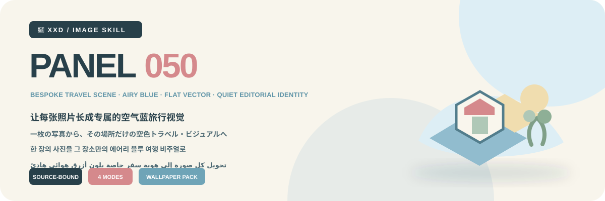
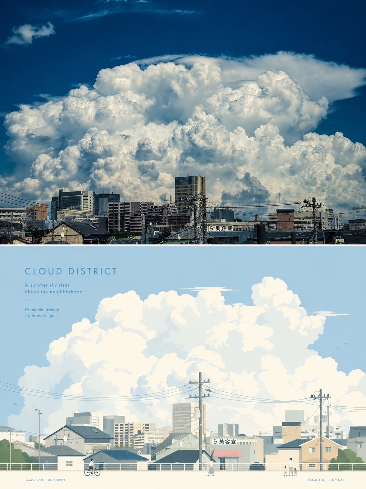
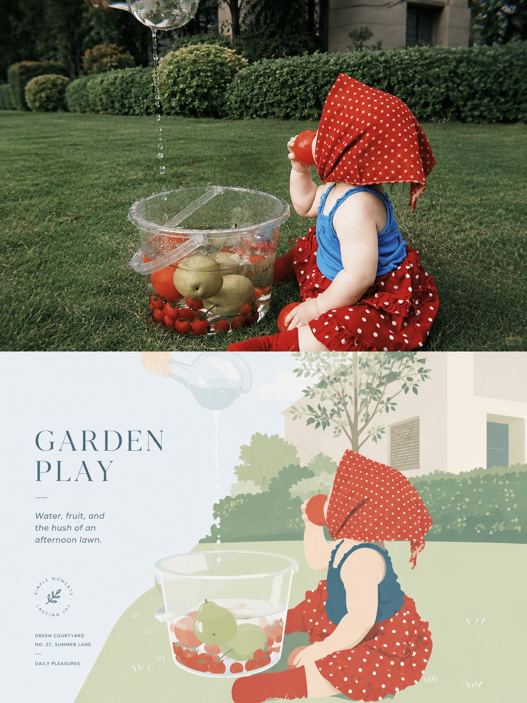
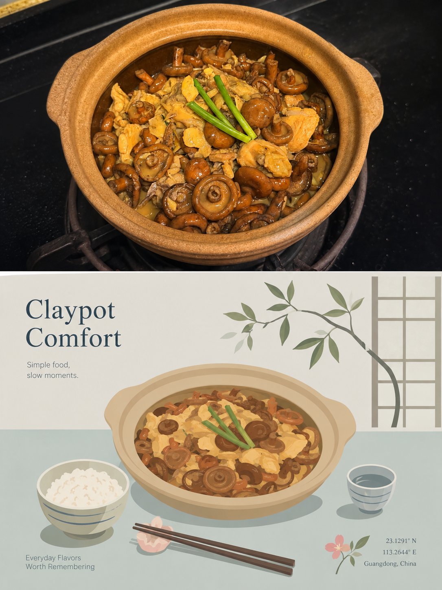

<p align="center"></p>

<div align="center" dir="rtl">

# 🦁 XXD Panel 050

### تحويل كل صورة إلى هوية سفر خاصة بلون أزرق هوائي هادئ

[](./SKILL.md)
[](#)
[](#)

<a href="README.md">简体中文</a> · <a href="README.en.md">English</a> · <a href="README.ja.md">日本語</a> · <a href="README.ko.md">한국어</a> · <strong>العربية</strong>

</div>

<div dir="rtl">

> مشهد سفر مخصّص · أزرق هوائي · متجهات مسطّحة بسيطة · فراغ تحريري · هوية مستقلة لكل صورة

تحوّل المهارة الموضوع الأكثر تميّزاً وعلاقته السردية في الصورة إلى هوية سفر راقية مصممة له وحده: مركز واحد، وعنصران إلى أربعة عناصر سياقية موثقة، وفراغ هادئ، ولوحة زرقاء خفيفة؛ لا قالب عام تُستبدل فيه أسماء المدن.

## المنطق الجمالي

```text
تثبيت الموضوع والوضعية والعلاقة السردية ← حفظ ثلاث سمات خاصة ← اختيار مركز بصري واحد ← استخراج دليلين إلى أربعة من البيئة ← إعادة التنظيم وفق الموضوع لا وفق قالب ← التوحيد بلغة متجهية مسطّحة زرقاء وهوائية ← حفظ مساحة تنفّس هادئة ← جعل العنوان والعبارة جزءاً من هوية المشهد
```

إذا أمكن استبدال المصدر بصورة لا علاقة لها من دون تغيير جوهري في التعرّف أو الأدلة السياقية أو النظام المكاني أو علاقة اللون والنص، فالنتيجة لا تنتمي إلى هذا Panel.

## العقد البصري

- تُحفظ ثلاث سمات خاصة بالمصدر على الأقل، ولا يتحول الموضوع إلى أيقونة عامة.
- يوجد مركز واحد فقط، ومعه عنصران إلى أربعة عناصر بيئية مدعومة بالمصدر. وعند الحاجة إلى أشخاص يُستخدم ثلاثة إلى ستة أشخاص صغار مندمجين في المكان.
- يحدد المصدر نوع المشهد؛ لا معالم غير مرتبطة، ولا قالب باسم مدينة، ولا صيغة بطاقة بريدية.
- تُستخدم حساسية القرطاسية اليابانية وملصقات البوتيك وهوية السفر التحريرية الحديثة: هندسة بسيطة، حدود ناعمة، سماكة خط متسقة، ألوان مسطحة، تفاصيل مقتصدة، وفراغ واسع.
- تقود اللوحة درجات الأزرق المسحوقي أو الضبابي أو السماوي أو البارد الهوائي، وتتوازن مع العاجي والكريمي والبيج الفاتح والأخضر الرمادي والمحايدات المعمارية. الوردي الغباري لمسة صغيرة فقط.
- يُرفض التصيير الواقعي وCG البلاستيكي والتدرجات والملمس والظلال الثقيلة والخلفية المزدحمة وتجميع المعالم والتخطيطات المكررة.

توجد المواصفات الكاملة في [SKILL.md](SKILL.md) و[مهايئ التشغيل](references/xxd-panel-050-prompt.en.md). وهي تحفظ الدافع الجمالي الأصلي من دون جعل لوحة 3:4 التاريخية قيمة افتراضية خفية.

## النماذج · من X

> [Xiaoxiaodong (@xiaoxiaodong01)](https://x.com/xiaoxiaodong01/status/2091461184516227185) · 23 أغسطس 2026<br>
> GPT2 × رسم متجهي × سفر × بساطة × توجيه جمالي × VOL.050

<table>
  <tr>
    <td width="50%"><a href="https://x.com/xiaoxiaodong01/status/2091461184516227185"></a></td>
    <td width="50%"><a href="https://x.com/xiaoxiaodong01/status/2091461184516227185"></a></td>
  </tr>
  <tr>
    <td width="50%"><a href="https://x.com/xiaoxiaodong01/status/2091461184516227185"></a></td>
  </tr>
</table>

<p align="center"><a href="https://x.com/xiaoxiaodong01/status/2091461184516227185">عرض المنشور الأصلي والتوجيه كاملاً ←</a></p>

تعرض هذه النماذج الدافع الجمالي للإصدار 050 فقط؛ ولا تصبح موضوعاتها أو تكوينها أو ألوانها أو نصوصها أو نسبة اللوحة السابقة مراجع للتوليد أو إعدادات افتراضية حالية.

## الموجّه الأصلي هو المرجع الجمالي الوحيد

الملف `references/050-source.md` هو المرجع الإبداعي والجمالي الوحيد للمشروع. لا تلخّص المهارة نصّه ولا توسعه، ولا تفرض لوحة ألوان مشتركة أو «دافعاً جمالياً» أو عنواناً أو حزمة نصوص قصيرة. يتبع GPT Image 2 قواعد الموجّه الأصلي نفسه في اللون والخامة والتكوين والفراغ والنص والطباعة.

لا يغيّر النمط والحجم إلا حاوية العرض القديمة 3:4 ذات الجزأين العلوي والسفلي. يعبّر نمط اليسار واليمين عن علاقة بصرية بين المصدر وتحويله التصميمي، من دون فرض نصفين متساويين أو إطار قص ثابت. وفي نمط التصميم وحده والخلفيات يمتد منطق التصميم السفلي إلى اللوحة كاملة. تبقى كل تعليمات الموجّه الأخرى فعّالة.

## أربعة مخرجات قابلة للجمع

يمكن اختيار واحد أو أكثر من `top-bottom` و`left-right` و`design-only` و`wallpaper-pack`. في اللوحة المزدوجة يُرسَل المصدر والموجّه الأصلي والعلاقة البصرية وحجم اللوحة معاً إلى نموذج الصور ليؤلف النتيجة كاملة. ولا يُستخدم الدمج الحتمي إلا إذا طلب المستخدم صراحةً تقسيمًا دقيقًا بالبكسل أو الحفاظ الحرفي على بكسلات المصدر.

العلاقة العلوية／السفلية أو اليسرى／اليمنى علاقة بصرية وليست حاويتين متساويتين ثابتتين. يختار نموذج الصور النِّسب والمقياس والفراغ والتراكب والقص أو توسيع البيئة وفق المصدر واللوحة النهائية، من دون قياس خط فصل أو نسبة منتصف أو إحداثيات بكسل.

يمكن أيضاً اختيار عدة أحجام: ملاءمة تلقائية، نسبة المصدر، 1:1، 3:4، 4:3، 4:5، 5:4، 2:3، 3:2، 9:16، 16:9، 21:9، 5:7، 7:5، أو نسبة مخصصة／أبعاد بكسل دقيقة. لا يوجد حجم افتراضي صامت، وتُعاد صياغة كل نسبة مختلفة بصورة مستقلة من الموجّه الأصلي نفسه.

حزمة الخلفيات إما مترابطة أو مستقلة. في الحزمة المترابطة تُنشأ صورة مرجعية أولى، ثم يُعاد تكوين كل جهاز من المصدر الأصلي مع تلك الصورة؛ ولا تُقص صورة واحدة آلياً إلى أربعة أحجام.

## أوضاع النص

قبل التوليد يُحسم خيار واحد:

1. **ينشئ النموذج النص وفق الموجّه الأصلي**: يحدد المستخدم اللغة أو المنطقة فقط، ويتبع GPT Image 2 منطق الموجّه في المحتوى والكمية والنبرة والطباعة، على أن تنشأ كل كلمة ظاهرة طبيعياً من محتوى الصورة الحالية أو أجوائها أو دلالتها الضمنية.
2. **استخدام نصي الحرفي**: يُمرر كما هو بلا إعادة صياغة أو ترجمة أو عنوان إضافي، مع بقاء الطباعة خاضعة للموجّه الأصلي.
3. **بلا نص**: يُمنع كل نص أو شبه نص.

لا تكتب المهارة الخارجية عنواناً أو نصوصاً قصيرة مسبقاً. تُحسم لغة الإخراج مستقلة عن لغة الواجهة، ولا تُستنتج من الشخص أو المشهد أو اسم الملف.

## أسئلة تتكيّف مع قدرات المضيف ومعاملات مضمنة

تتكيّف المهارة نفسها مع أدوات التفاعل المتاحة فعلياً، ولا تعرض رموزاً زخرفية كما لو كانت عناصر قابلة للنقر:

- **عندما يوفّر Claude Code ‏`AskUserQuestion + multiSelect: true`**: تستخدم الأنماط والأحجام مربعات اختيار حقيقية، ويستخدم نمط النص وعلاقة الخلفيات اختياراً منفرداً. تُقسّم الأحجام الشائعة إلى مربع وعمودي وأفقي، وتتراكم الاختيارات، وتُدخل القيم المخصصة بحرية.
- **عندما لا يوفّر Codex سوى `request_user_input`**: يُستخدم فقط للحقول المتنافية مثل نمط النص وعلاقة الخلفيات. لا تُعرض الأنماط أو الأحجام كاختيار منفرد، بل تُجمع بإدخال تركيبي واضح.
- **عند غياب أداة تفاعلية**: تُستخدم جولتان نصيتان؛ الأنماط أولاً، ثم الأحجام مع نمط النص. لا تظهر مربعات `- [ ]` زائفة، ولا يُطلب الانتقال إلى Plan mode لمجرد الحصول على نموذج.

تعرض الجولة الثانية أولاً: توصية ذكية／نسبة المصدر／النسب الشائعة／مخصص. لا تُفتح المكتبة الكاملة إلا عند الطلب: مربع `1:1`؛ عمودي `3:4, 4:5, 2:3, 9:16, 5:7`؛ أفقي `4:3, 5:4, 3:2, 16:9, 21:9, 7:5`. يمكن جمع أي نسب وإدخال أبعاد بكسل دقيقة.

يمكن تمرير كل الإعدادات مباشرة:

```text
/xxd-panel-050 photo.jpg --mode top-bottom,design-only --size auto,3:4,9:16 --text prompt --locale ja-JP
```

تدعم المهارة `--mode` و`--size` المتكرر، و`--text prompt|exact|none`، و`--locale`، و`--copy`، و`--wallpaper linked|independent`، و`--wallpaper-size`، و`--out`. تتجاوز القيم المكتملة جميع الأسئلة، ولا تُسأل إلا القيم الناقصة.

## أولوية نموذج الصور

يظل GPT Image 2 الخيار الأول افتراضياً، مع الحفاظ على سير العمل الحالي: مرجع المصدر عالي الوفاء، وحسم اللوحة النهائية قبل التوليد، وتوليد اللوحة الثنائية كاملة في عملية واحدة، وعدم استخدام التركيب البرمجي إلا كحل احتياطي مشروط.

يمكن أيضاً استخدام Seedance 5.0 Pro أو Nano Banana Pro (Gemini Image Pro) أو Nano Banana 2 (Gemini Image Flash) أو نموذج نقطي متوافق آخر عندما يكون متاحاً فعلاً عبر الأدوات الحالية أو المسارات المضبوطة، وقادراً على تلبية وفاء المصدر ونسبة اللوحة النهائية ونص اللغة المستهدفة والمراجع المتعددة للخلفيات المترابطة. يغيّر النموذج البديل مسار التوليد فقط، ولا يغيّر الأنماط أو اللوحة أو النص أو اللغة أو علاقة الخلفيات أو أولوية اللوحة الكاملة.

إذا لم يوجد مسار مناسب، تطلب المهارة من المستخدم تفعيل أداة لتوليد الصور أو تقديم API Key. يمكن استخدام بيانات الاعتماد التي يقدمها المستخدم للمهمة الحالية من دون تكرارها أو عرضها أو تسجيلها أو كشفها. ولا تُحفظ طويلاً ولا تتغير إعدادات المزوّد أو الحساب أو الفوترة أو المسار العام إلا بطلب صريح من المستخدم.

## البدء

```bash
git clone https://github.com/nevertoday/xxd-panel-050.git
mkdir -p ~/.codex/skills
ln -s "$(pwd)/xxd-panel-050" ~/.codex/skills/xxd-panel-050
```

يمكن لمستخدمي Claude Code ربط المجلد نفسه بالمسار `~/.claude/skills/xxd-panel-050`. أعد تشغيل جلسة الوكيل بعد التثبيت.

المواصفات: [Skill](SKILL.md) · [المصدر الأصلي](references/050-source.md) · [التوجيه الإنجليزي](references/xxd-panel-050-prompt.en.md) · [التوجيه الصيني](references/xxd-panel-050-prompt.zh-CN.md)

## عن XXD والدعم

XXD اختصار لعلامة Xiaoxiaodong، أنشأها ويديرها [@xiaoxiaodong01](https://x.com/xiaoxiaodong01). الاستشارة المتعمقة 299 يواناً/ساعة، ومجموعة مستخدمي Skills بدفعة واحدة قدرها 99 يواناً. يفتح دفع سنوي واحد قدره 699 يواناً كلاً من Knowledge Planet ومكتبة التوجيهات. بعد الاشتراك في [Knowledge Planet](https://wx.zsxq.com/group/15554814142882)، تواصل عبر WeChat للحصول على رمز استرداد [مكتبة التوجيهات](https://vip.xiaoxiaodong.ai/)؛ وبعد التفعيل الذاتي في المكتبة، تواصل للحصول على دعوة إلى Knowledge Planet. [WeChat](https://xiaoxiaodong.pages.dev/assets/wechat-qr.png)

<p align="center"><a href="https://xiaoxiaodong.pages.dev/assets/wechat-qr.png"></a></p>

<div align="center"><strong>لا تستبدل اسم المكان؛ امنح هذه الصورة هويتها الخاصة للسفر.</strong></div>

---

<div align="center">

## ☕ دعم المشروع المفتوح المصدر

الدعم اختياري ولا يغيّر الوصول إلى المشروع المفتوح المصدر.

<p align="center"><a href="https://github.com/nevertoday/zhongguo-traditional-colors/blob/main/docs/images/buy-me-a-coffee-qr.png?raw=true"></a></p>

</div>
</div>
